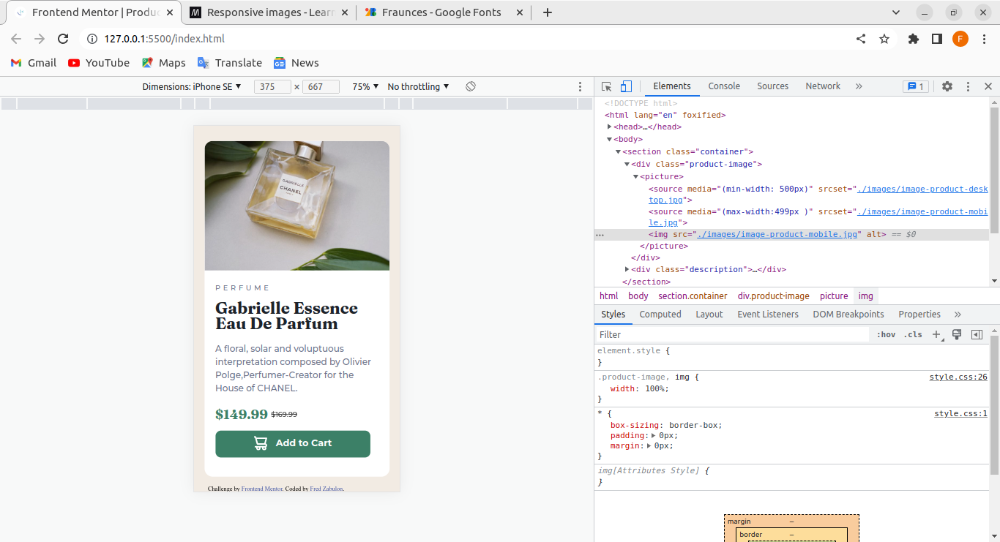

## Table of contents

- [Overview](#overview)
  - [The challenge](#the-challenge)
  - [Screenshot](#screenshot)
  - [Links](#links)
- [My process](#my-process)
  - [Built with](#built-with)
  - [What I learned](#what-i-learned)
  - [Continued development](#continued-development)
  - [Useful resources](#useful-resources)
- [Author](#author)


## Overview
This is a solution to the [Product preview card component challenge on Frontend Mentor](https://www.frontendmentor.io/challenges/product-preview-card-component-GO7UmttRfa).
It was a little bit challenging and also helped skill-up my knowledge.

### The challenge

Users should be able to:

- View the optimal layout depending on their device's screen size
- See hover and focus states for interactive elements

### Screenshot




### Links

- Solution URL: [Add solution URL here](https://your-solution-url.com)
- Live Site URL: [Add live site URL here](https://your-live-site-url.com)

## My process
- i started by finding out ways i can come up with the solution to challege.
- i worked first on the mobile view ,the tablet and at last desktop view
### Built with

- Semantic HTML5 markup
- CSS custom properties
- Flexbox
- Mobile-first workflow

### What I learned
- I learned on how to use the picture tag to render different images for different device sizes.
- I also learned that using an inline-flex somehow centers the element within its parent but dont know whether thats how it should behave.

```html
<picture>
        <source media="(min-width: 500px)" srcset="./images/image-product-desktop.jpg">
        <source media="(max-width:499px )" srcset="./images/image-product-mobile.jpg">
        
</picture>
```
```css
.cart-content{
    display: inline-flex;
    align-items: center;
}
```

### Continued development
- responsive design including responsive images.
- animations

### Useful resources

- (https://developer.mozilla.org/en-US/docs/Learn/HTML/Multimedia_and_embedding/Responsive_images) - This helped me in understanding on how to implement responsive images.

## Author

- Frontend Mentor - [Fred Zabulon](https://www.frontendmentor.io/profile/fredzabu)
- Twitter - [Fred Zabulon](https://www.twitter.com/Asiimwefred20)